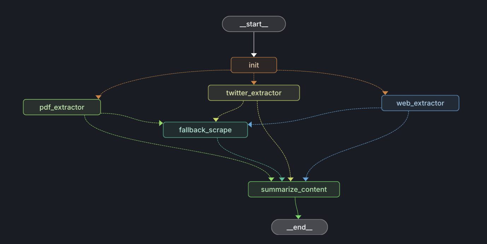

# Telegram Link Summarizer Agent



An agentic Telegram bot designed to summarize web links (articles, papers, etc.) sent in a chat. It uses LangGraph to orchestrate multiple tools and language models to extract content, search for relevant information, and generate concise summaries.

## ✨ Features

*   **Link Summarization:** Extracts content from URLs and provides summaries.
*   **Web Search Integration:** Uses Tavily Search to gather context if needed.
*   **PDF Support:** Can process and summarize PDF documents found at URLs.
*   **Twitter/X Support:** Fetches tweet content using Tweepy.
*   **Agentic Workflow:** Leverages LangGraph for a multi-step reasoning process.
*   **BAML Integration:** Uses BAML for structured output generation.
*   **Telegram Bot Interface:** Interacts via a simple Telegram bot.

## 🛠️ Tech Stack

*   **Twitter/X API:** Tweepy
*   **Orchestration:** LangGraph
*   **LLM Interaction/Structured Output:** BAML (Boundary)
*   **Telegram Bot:** `python-telegram-bot`
*   **Web Scraping:** Firecrawl, Beautiful Soup, Pyppeteer
*   **Search:** Tavily Search
*   **Language Models:** Configurable (defaults likely via LangChain/OpenAI)
*   **Dependencies:** Managed via `pyproject.toml` (using `uv` or `pip`)

## 🚀 Setup

1.  **Clone the repository:**
    ```bash
    git clone <your-repo-url>
    cd telegram_link_summarizer_agent
    ```

2.  **Install Dependencies (using [`uv`](https://github.com/astral-sh/uv) or `pip`))**
    *   You can use [`uv`](https://github.com/astral-sh/uv) or standard `pip`:
        ```bash
        # Using uv
        uv pip install .

        # Or using pip
        pip install .
        ```

3.  **Set up Environment Variables:**
    Create a file named `.env` in the project root directory. Add the following environment variables with your actual values:
    ```env
    # API Keys for Language Models and Tools
    GEMINI_API_KEY="your_gemini_api_key"
    DEEPSEEK_API_KEY="your_deepseek_api_key"
    TAVILY_API_KEY="your_tavily_api_key"
    X_BEARER_TOKEN="your_twitter_v2_bearer_token" # Needed for fetching tweets

    # Telegram Bot Configuration
    TELEGRAM_BOT_TOKEN="your_telegram_bot_token"

    # Webhook Configuration (Needed for local testing with ngrok or deployment)
    # For ngrok, use the https://<your-ngrok-subdomain>.ngrok-free.app URL
    # For deployment, this isn't strictly needed in the .env for the *deployed* app,
    # but the deployment script will set the webhook based on the Cloud Run URL.
    WEBHOOK_URL="your_webhook_url_or_ngrok_url"

    # Secure your webhook (generate strong random strings for these)
    TELEGRAM_WEBHOOK_SECRET_TOKEN="your_strong_random_secret_token"
    # Example: /webhook/aBcDeF12345 - must start with a slash!
    WEBHOOK_SECRET_PATH="/your_unique_and_random_webhook_path"
    ```
    **Important:** Keep your `.env` file secure and do not commit it to version control. The `.gitignore` file should already include `.env`.

## ▶️ Usage

1.  **(Optional) Run the Agent Script Directly (for testing):**
    *   You can test the core agent logic by running `agent.py`. Modify the example URL within the script if needed.
    ```bash
    python agent.py
    ```

2.  **(Optional) Deploy to LangGraph Studio:**
    *   If you have the LangGraph CLI installed (`pip install langgraph-cli`), you can deploy your agent graph for monitoring and debugging:
    ```bash
    langgraph deploy
    ```
    *   Follow the CLI prompts to name your deployment.

3.  **Start the Telegram Bot (Primary Usage):**
    *   **Note:** This interface is currently untested.
    ```bash
    python bot.py
    ```

4.  **Interact with the Bot:**
    *   Open Telegram and find the bot you created.
    *   Send a message containing a URL (e.g., `https://example.com/article`).
    *   The bot will process the link and reply with a summary.

## 📊 Agent Visualization

The `agent_viz.py` script can be used to generate a visualization of the LangGraph agent (like the image at the top). Run it if needed:

```bash
marimo edit agent_viz.py
```

This will open marimo and you can run and visualize the agent graph flow.

## Local Running

This runs the FastAPI server directly using `uvicorn`. Note that without a publicly accessible `WEBHOOK_URL` set in your `.env` file (e.g., using ngrok), the bot will not receive messages from Telegram when run locally this way.

Make sure you have installed dependencies (`uv sync`) and configured your `.env` file.

```bash
# Make the script executable (only needed once)
chmod +x ./scripts/run_local.sh

# Run the local server
./scripts/run_local.sh
```

You can check if the server is running by accessing the health check endpoint: `curl http://localhost:8080/health`

## Testing Webhooks Locally with ngrok

When running your bot locally, Telegram cannot reach your computer directly because `localhost` is not accessible from the public internet. To test real Telegram messages with webhooks during development, you can use [ngrok](https://ngrok.com/) to create a secure tunnel from a public URL to your local machine.

### Steps

1.  **Install ngrok:**
   - Download from https://ngrok.com/download or install via your package manager.
   - On macOS (Homebrew):
     ```bash
     brew install ngrok
     ```
   - On Linux:
     ```bash
     sudo snap install ngrok
     ```
   - On Windows: Download and extract the executable from the website.

2.  **Start your local server:**
   ```bash
   # Ensure the script is executable
   chmod +x ./scripts/run_local.sh
   # Run the local server
   ./scripts/run_local.sh
   ```

3.  **Start ngrok to expose port 8080:**
   ```bash
   ngrok http 8080
   ```
   - You will see output like:
     ```
     Forwarding https://abcd-1234.ngrok-free.app -> http://localhost:8080
     ```
   - Copy the HTTPS URL provided by ngrok (e.g., `https://abcd-1234.ngrok-free.app`).

4.  **Update your `.env` file:**
   - Set the `WEBHOOK_URL` to the ngrok HTTPS URL:
     ```env
     WEBHOOK_URL=https://your-ngrok-url.ngrok-free.app
     ```
   - Save the file.

5.  **Restart your local server:**
   - Stop the running `./scripts/run_local.sh` process (Ctrl+C) and start it again:
     ```bash
     ./scripts/run_local.sh
     ```
   - On startup, the bot should attempt to register the webhook with Telegram using your public ngrok URL (if `bot.py` is configured to do so based on `WEBHOOK_URL`).

6.  **Test your bot:**
   - Send a message with a link to your Telegram bot as usual.
   - Telegram will send the update to your ngrok public URL, which forwards it to your local server.
   - You should see logs in your terminal and receive a response from your local bot.

**Tip:** If you restart ngrok, you will get a new public URL. Update your `.env` and restart the server each time.

**Security Note:** For production, always use a secret path (`WEBHOOK_SECRET_PATH`) and a secret token (`TELEGRAM_WEBHOOK_SECRET_TOKEN`) for your webhook endpoint. For local ngrok testing, ensure these variables are also set in your `.env` if your `bot.py` requires them even locally.

## Docker Testing

This builds the Docker image and runs the container locally. Ensure your `.env` file is present and configured in the project root.

```bash
# Make the script executable (only needed once)
chmod +x ./scripts/run_docker.sh

# Build and run the Docker container
./scripts/run_docker.sh
```

You can check the health endpoint at `http://localhost:8080/health`

### Testing Docker Locally with ngrok

You can also test the Docker container with ngrok to receive real Telegram messages:

1.  **Run the Docker Container:**
    ```bash
    # Ensure script is executable
    chmod +x ./scripts/run_docker.sh
    # Build and run the container (loads .env)
    ./scripts/run_docker.sh 
    ```
    *(Leave this terminal running)*

2.  **Start ngrok:** In a *new* terminal, run:
    ```bash
    ngrok http 8080 
    ```
    Copy the HTTPS URL provided by ngrok.

3.  **Update `.env`:** Set the `WEBHOOK_URL` variable in your `.env` file to the ngrok HTTPS URL.

4.  **Restart Docker Container:** Stop the running container (Ctrl+C in the first terminal, or `docker stop summarizer-bot`) and restart it using:
    ```bash
    ./scripts/run_docker.sh
    ```
    This ensures the container picks up the new `WEBHOOK_URL` from the `.env` file.

5.  **Test:** Send messages to your bot. They should be routed through ngrok to your running Docker container.

## Deploying to Google Cloud Run

This guide assumes you have a GCP account, `gcloud` CLI installed and configured, and Docker installed.

The deployment process involves:
1.  **Setting up Secrets:** Securely store your API keys and tokens in Google Cloud Secret Manager.
2.  **Building & Pushing Image:** Build the Docker image and push it to Google Artifact Registry.
3.  **Deploying Service:** Deploy the image to Cloud Run, mapping the secrets to environment variables.
4.  **Setting Webhook:** Configure the Telegram webhook to point to your Cloud Run service URL.

We have provided scripts to streamline this process.

### 1. Setup Secrets

This script helps you create secrets in Google Cloud Secret Manager and add your sensitive values (API keys, tokens).

**IMPORTANT:** Before running, you **must** edit the `SECRETS` array inside `scripts/setup_secrets.sh` to include the *exact names* of the environment variables defined in your `.env` file (e.g., `TELEGRAM_BOT_TOKEN`, `TAVILY_API_KEY`, etc.).

```bash
# Make the script executable (only needed once)
chmod +x ./scripts/setup_secrets.sh

# Run the secret setup script (it will prompt for project ID and secret values)
./scripts/setup_secrets.sh
```

Follow the prompts to enter your GCP Project ID (if not already configured) and the values for each secret.

### 2. Deploy to Cloud Run

This script automates building the image, pushing it to Artifact Registry, deploying to Cloud Run, and setting the Telegram webhook.

**IMPORTANT:** Before running, you **must** edit the `SECRETS_TO_MAP` array inside `scripts/deploy_cloud_run.sh`. This array defines how the secrets you created in Secret Manager map to environment variables in your Cloud Run service. Ensure the secret names match those used in `setup_secrets.sh`.

```bash
# Make the script executable (only needed once)
chmod +x ./scripts/deploy_cloud_run.sh

# Run the deployment script (it will prompt for configuration)
./scripts/deploy_cloud_run.sh
```

The script will prompt you for your GCP Project ID, Region, Service Name, and Artifact Registry Repository Name if they are not set as environment variables. It will then guide you through the build, push, and deployment process, including setting the Telegram webhook automatically if it can find your `TELEGRAM_BOT_TOKEN` secret mapping.

### Manual Steps (If needed)

If you prefer to run the steps manually or need to troubleshoot, the original commands are detailed below. The deployment script automates these.

<details>
<summary>Click to view manual gcloud commands</summary>

1.  **Set Environment Variables (Shell):**
    ```bash
    export PROJECT_ID="your-gcp-project-id"
    export REGION="your-preferred-region" # e.g., us-central1
    export SERVICE_NAME="telegram-summarizer"
    export REPO_NAME="my-summarizer-bot-repo" # Or your preferred Artifact Registry repo name
    export IMAGE_NAME="${REGION}-docker.pkg.dev/${PROJECT_ID}/${REPO_NAME}/${SERVICE_NAME}:latest"

    gcloud config set project $PROJECT_ID
    gcloud config set run/region $REGION
    ```
2.  **Enable Required APIs:**
    ```bash
    gcloud services enable run.googleapis.com artifactregistry.googleapis.com cloudbuild.googleapis.com secretmanager.googleapis.com
    ```
3.  **Create Artifact Registry Repository (if needed):**
    ```bash
    gcloud artifacts repositories create $REPO_NAME \
      --repository-format=docker \
      --location=$REGION \
      --description="Docker repository for bots"
    ```
4.  **Configure Docker Authentication:**
    ```bash
    gcloud auth configure-docker ${REGION}-docker.pkg.dev
    ```
5.  **Manage Secrets with Secret Manager (Recommended):**
    Store API keys and tokens securely using Google Cloud Secret Manager. Use the `gcloud` CLI (as done by `setup_secrets.sh`):

    *   **Create Secret:** (Do this once per secret, e.g., `telegram-bot-token`, `tavily-api-key`)
        ```bash
        # Example for bot token
        gcloud secrets create telegram-bot-token --replication-policy="automatic"
        # Example for Tavily key
        gcloud secrets create tavily-api-key --replication-policy="automatic"
        # Add others as needed...
        ```

    *   **Add Secret Version (Add the actual value):**
        ```bash
        # Example for bot token - you will be prompted for the value
        printf "YOUR_ACTUAL_TELEGRAM_BOT_TOKEN" | gcloud secrets versions add telegram-bot-token --data-file=-

        # Example for Tavily key - you will be prompted for the value
        printf "YOUR_ACTUAL_TAVILY_API_KEY" | gcloud secrets versions add tavily-api-key --data-file=-
        # Add others as needed...
        ```

6.  **Build and Push Docker Image:**
    ```bash
    # Build
    docker build -t $IMAGE_NAME .
    # Push
    docker push $IMAGE_NAME
    ```

7.  **Deploy to Cloud Run:**
    Replace `SECRET_NAME=SECRET_ID:latest,...` with your actual secret mappings.
    ```bash
    gcloud run deploy $SERVICE_NAME \
      --image $IMAGE_NAME \
      --platform managed \
      --region $REGION \
      --port 8080 \
      --allow-unauthenticated \
      --set-secrets=TELEGRAM_BOT_TOKEN=telegram-bot-token:latest,TAVILY_API_KEY=tavily-api-key:latest,GEMINI_API_KEY=gemini-api-key:latest,WEBHOOK_SECRET_TOKEN=webhook-secret-token:latest
      # Add other flags like --cpu, --memory if needed
    ```
    **Important:** The service account used by Cloud Run (usually `PROJECT_NUMBER-compute@developer.gserviceaccount.com`) needs the "Secret Manager Secret Accessor" IAM role for the secrets you are mapping.

8.  **Get Service URL & Set Telegram Webhook:**
    ```bash
    # Get the URL
    SERVICE_URL=$(gcloud run services describe $SERVICE_NAME --platform managed --region $REGION --format 'value(status.url)')
    echo "Service URL: $SERVICE_URL"

    # Get your bot token (replace secret-id if different)
    TELEGRAM_BOT_TOKEN=$(gcloud secrets versions access latest --secret=telegram-bot-token)
    # Get your webhook secret (optional, replace secret-id if different)
    WEBHOOK_SECRET=$(gcloud secrets versions access latest --secret=telegram-webhook-secret-token)

    # Set the webhook (adjust path /webhook if needed)
    curl -F "url=${SERVICE_URL}/webhook" \
         -F "secret_token=${WEBHOOK_SECRET}" \
         https://api.telegram.org/bot${TELEGRAM_BOT_TOKEN}/setWebhook
    ```

</details>

## ☁️ Deployment

### 1. Run the Setup Secrets Script:
    This script will guide you to create the necessary secrets in Google Cloud Secret Manager if they don't already exist.
    ```bash
    # Make executable (if needed)
    chmod +x ./scripts/setup_secrets.sh
    # Run the script
    ./scripts/setup_secrets.sh
    ```
    Follow the prompts to provide your API keys and tokens.

### 2. Run the Deployment Script:
    This script handles building the Docker image, pushing it to Google Artifact Registry, and deploying it to Cloud Run with the correct secret configuration and webhook setup.
    ```bash
    # Make executable (if needed)
    chmod +x ./scripts/deploy_cloud_run.sh
    # Run the script
    ./scripts/deploy_cloud_run.sh
    ```
    The script will prompt you for necessary information like GCP Project ID, Region, Service Name, etc.

## License

This project is licensed under the Apache License 2.0. See the [LICENSE](LICENSE) file for details.