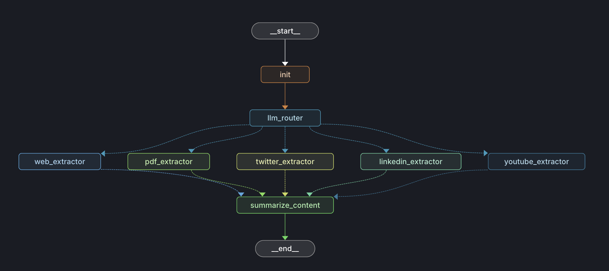

# Telegram Link Summarizer Agent



An agentic Telegram bot designed to summarize web links (articles, papers, etc.) sent in a chat. It uses LangGraph to orchestrate multiple tools and language models to extract content, search for relevant information, and generate concise summaries.

## ✨ Features

*   **Link Summarization:** Extracts content from URLs and provides summaries.
*   **Web Search Integration:** Uses Tavily Search to gather context if needed.
*   **PDF Support:** Can process and summarize PDF documents found at URLs.
*   **Agentic Workflow:** Leverages LangGraph for a multi-step reasoning process.
*   **BAML Integration:** Uses BAML for structured output generation.
*   **Telegram Bot Interface:** Interacts via a simple Telegram bot.

## 🛠️ Tech Stack

*   **Orchestration:** LangGraph
*   **LLM Interaction/Structured Output:** BAML (Boundary)
*   **Telegram Bot:** `python-telegram-bot`
*   **Web Scraping:** Firecrawl, Beautiful Soup, Pyppeteer
*   **Search:** Tavily Search
*   **Language Models:** Configurable (defaults likely via LangChain/OpenAI)
*   **Dependencies:** Managed via `pyproject.toml` (using `uv` or `pip`)

## 🚀 Setup

1.  **Clone the repository:**
    ```bash
    git clone <your-repo-url>
    cd telegram_link_summarizer_agent
    ```

2.  **Install Dependencies (using [`uv`](https://github.com/astral-sh/uv))**
    *   You can use [`uv`](https://github.com/astral-sh/uv) to install dependencies:
        ```bash
        uv sync
        ```

3.  **Configure Environment Variables:**
    *   Create a `.env` file in the root directory and put your credentials there.   
    *   Fill in the required API keys and tokens in your `.env` file:
        *   `TELEGRAM_BOT_TOKEN`: Your Telegram Bot token from BotFather.
        *   `TAVILY_API_KEY`: Your Tavily Search API key.
        *   `GEMINI_API_KEY`: API key for the LLM used by BAML.
        *   *(Add any other keys required by `config.py`)*

## ▶️ Usage

1.  **(Optional) Run the Agent Script Directly (for testing):**
    *   You can test the core agent logic by running `agent.py`. Modify the example URL within the script if needed.
    ```bash
    python agent.py
    ```

2.  **(Optional) Deploy to LangGraph Studio:**
    *   If you have the LangGraph CLI installed (`pip install langgraph-cli`), you can deploy your agent graph for monitoring and debugging:
    ```bash
    langgraph deploy
    ```
    *   Follow the CLI prompts to name your deployment.

3.  **Start the Telegram Bot (Primary Usage):**
    *   **Note:** This interface is currently untested.
    ```bash
    python bot.py
    ```

4.  **Interact with the Bot:**
    *   Open Telegram and find the bot you created.
    *   Send a message containing a URL (e.g., `https://example.com/article`).
    *   The bot will process the link and reply with a summary.

## 📊 Agent Visualization

The `agent_viz.py` script can be used to generate a visualization of the LangGraph agent (like the image at the top). Run it if needed:

```bash
marimo edit agent_viz.py
```

This will open marimo and you can run and visualize the agent graph flow.

## Deployment to Google Cloud Run

This section outlines the steps to deploy the Telegram Link Summarizer Bot to Google Cloud Run using Google Cloud Build and Artifact Registry.

**Prerequisites:**

*   Google Cloud SDK (`gcloud`) installed and configured.
*   Docker installed locally (optional, only if building locally instead of using Cloud Build).
*   A Google Cloud Project.

**Steps:**

1.  **Authenticate gcloud:**
    Log in with your user account and set up Application Default Credentials:
    ```bash
    gcloud auth login
    gcloud auth application-default login
    ```

2.  **Set Project Configuration:**
    Replace `YOUR_PROJECT_ID` with your actual Google Cloud Project ID.
    ```bash
    gcloud config set project YOUR_PROJECT_ID
    ```

3.  **Enable APIs:**
    Ensure the following APIs are enabled for your project in the Google Cloud Console:
    *   Cloud Build API
    *   Cloud Run Admin API
    *   Artifact Registry API
    *   Secret Manager API

4.  **Create Artifact Registry Repository:**
    Create a Docker repository to store your container images. Replace `my-summarizer-bot-repo` and `us-central1` if desired.
    ```bash
    gcloud artifacts repositories create my-summarizer-bot-repo \
        --repository-format=docker \
        --location=us-central1 \
        --description="Telegram Bot link summarizer images"
    ```

5.  **Configure Docker Authentication:**
    Allow Docker to push images to your Artifact Registry repository (replace `us-central1` if you used a different region).
    ```bash
    gcloud auth configure-docker us-central1-docker.pkg.dev
    ```

6.  **Setup Secret Manager:**
    Store sensitive information like API keys and bot tokens securely.
    *   Go to the Secret Manager section in the Google Cloud Console.
    *   Create secrets for:
        *   `TELEGRAM_BOT_TOKEN` (name it e.g., `telegram-bot-token`)
        *   `TAVILY_API_KEY` (name it e.g., `tavily-api-key`)
        *   Any other secrets your application needs.
    *   Grant the **Compute Engine default service account** (`YOUR_PROJECT_NUMBER-compute@developer.gserviceaccount.com`) the **Secret Manager Secret Accessor** (`roles/secretmanager.secretAccessor`) IAM role for each secret you created.

7.  **Build the Container Image using Cloud Build:**
    This command builds the Docker image using the `Dockerfile` in your project directory and pushes it to your Artifact Registry repository. Replace `YOUR_PROJECT_ID`, `my-summarizer-bot-repo`, and region (`us-central1`) if necessary.
    ```bash
    gcloud builds submit --tag us-central1-docker.pkg.dev/YOUR_PROJECT_ID/my-summarizer-bot-repo/telegram-summarizer:latest .
    ```

8.  **Deploy to Cloud Run:**
    Deploy the container image as a Cloud Run service. Replace placeholders as needed.
    *   `telegram-summarizer-service`: Choose a name for your service.
    *   `YOUR_PROJECT_ID`, `my-summarizer-bot-repo`, region (`us-central1`): Match your configuration.
    *   Secret names (`telegram-bot-token`, `tavily-api-key`): Use the names you created in Secret Manager.
    ```bash
    gcloud run deploy telegram-summarizer-service \
        --image us-central1-docker.pkg.dev/YOUR_PROJECT_ID/my-summarizer-bot-repo/telegram-summarizer:latest \
        --platform managed \
        --region us-central1 \
        --set-secrets=TELEGRAM_BOT_TOKEN=telegram-bot-token:latest,TAVILY_API_KEY=tavily-api-key:latest
        # Add other secrets like: ,ANOTHER_SECRET=secret-name:latest
    ```
    *Note: The `--allow-unauthenticated` flag is **not** included here because the current bot uses polling. If you modify the bot to use webhooks, you will need to add `--allow-unauthenticated` to allow Telegram to send updates to your service.*

9.  **Check Logs:**
    Monitor the logs for your deployed service in the Cloud Run section of the Google Cloud Console to ensure it started correctly.

**Important Considerations:**

*   **Polling vs. Webhooks:** The current implementation uses polling (`application.run_polling()`), which is not ideal or cost-effective for Cloud Run's scale-to-zero model. It's highly recommended to modify `bot.py` to use Telegram Webhooks, which requires running a simple web server (like Flask or FastAPI) within the container and setting the webhook URL with Telegram after deployment.
*   **Costs:** Be mindful of potential costs associated with Cloud Build, Artifact Registry, Secret Manager, and Cloud Run execution time.